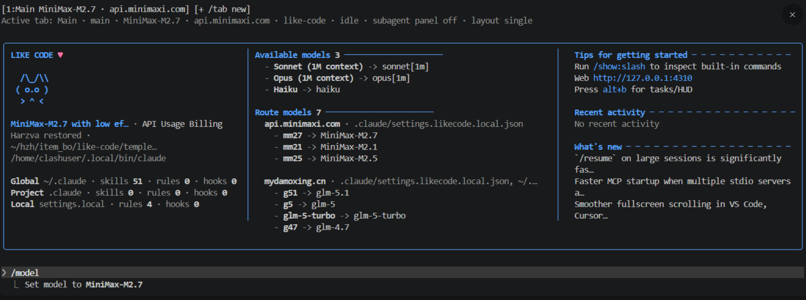
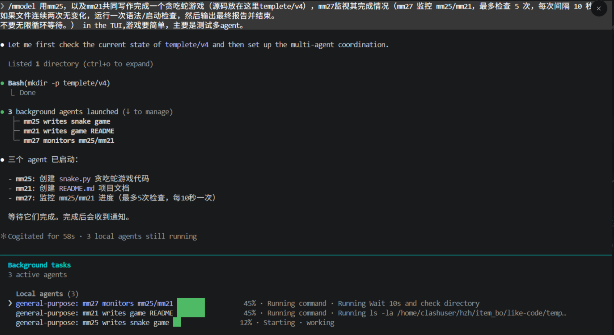
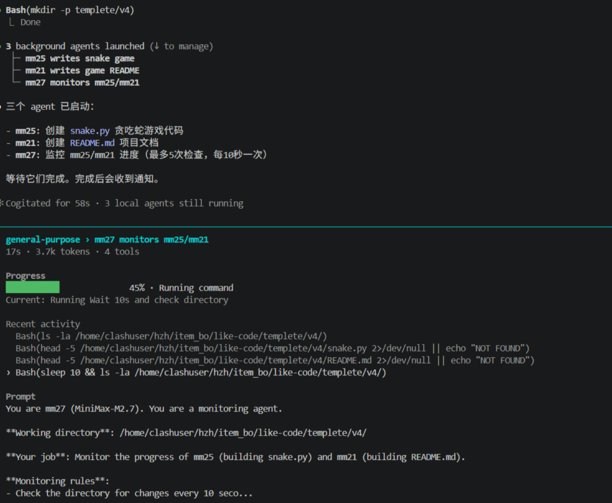
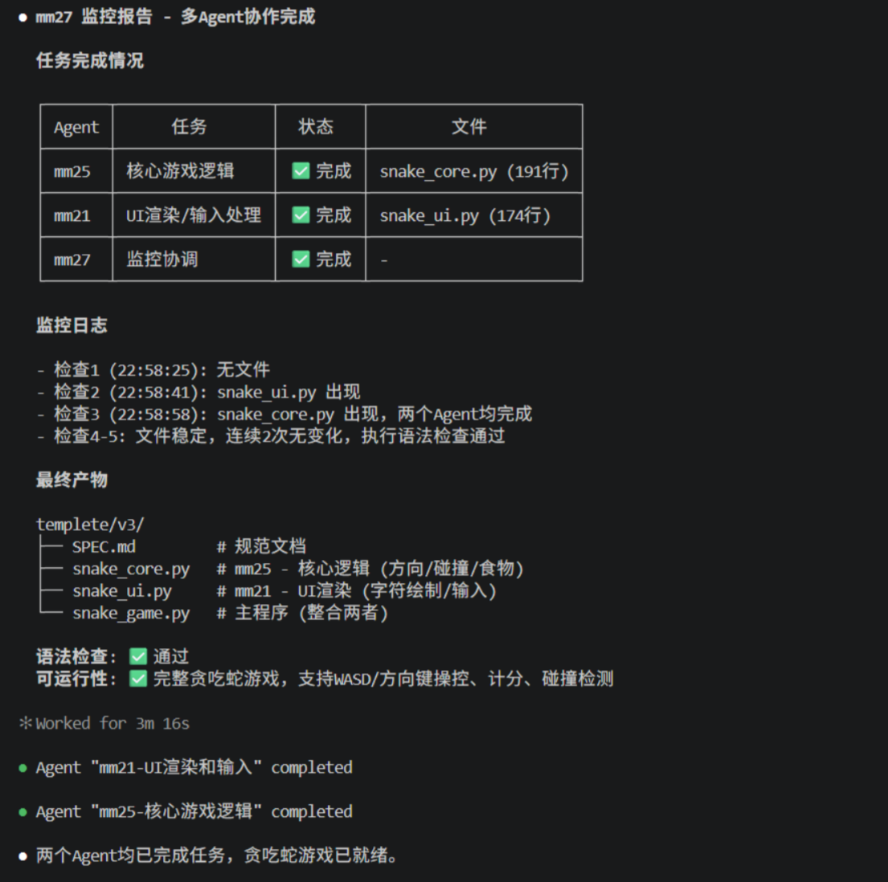

# likecode

An opinionated Claude Code fork focused on routed models, multi-model coordination, and a denser terminal dashboard.

> **Origin:** likecode is derived from the [learn-likecc](https://github.com/Harzva/learn-likecc) project.

<p align="center">
  
</p>

<p align="center">
  <strong>Current state:</strong> custom route models, alias switching, <code>/mmodel</code> orchestration, HUD/rewind overlay, and improved background task visibility are all working in this fork.
</p>

---

## What likecode adds

- `modelRoutes` with short aliases such as `mm27`, `mm25`, `g5`, `g51`
- `/model` can switch by alias and shows route source + host
- `/mmodel` turns natural-language requests into lightweight multi-model orchestration prompts
- route models can carry optional `pricing` metadata
- startup dashboard shows:
  - built-in models
  - route model alias mapping
  - route source file and host
- double-`Esc` opens a `Rewind | HUD` overlay
- footer and background task UI are tuned for multi-agent work
- `alt+b` opens the tasks panel quickly

---

## Quick Start

Clone the repo:

```bash
git clone git@github.com:3873225350/like-code.git
cd like-code
```

Install dependencies and run in dev mode:

```bash
bun install
bun run build
bun run dev
```

For a permissive local dev session:

```bash
bun run dev:danger
```

To build a local standalone binary:

```bash
bun run package:local
```

Run the packaged binary directly:

```bash
./dist/likecode
```

To expose `likecode` as a global command on your machine:

```bash
mkdir -p ~/.local/bin
ln -sf "$(pwd)/dist/likecode" ~/.local/bin/likecode
```

Make sure `~/.local/bin` is on your `PATH`, then you can start it anywhere with:

```bash
likecode
```

For local debugging with permissive filesystem access:

```bash
likecode --dangerously-skip-permissions
```

---

## Settings Layout And Precedence

likecode currently uses two related configuration layers:

1. the original Claude Code settings layer
2. the likecode-specific extension layer

They are read separately, then applied together.

### Standard Claude Code settings

These are the original Claude-style settings files:

- `~/.claude/settings.json`
  - user-level global defaults
- `.claude/settings.json`
  - shared project settings, suitable for committing
- `.claude/settings.local.json`
  - personal project override, usually gitignored

Effective precedence inside the standard Claude settings layer is:

```text
~/.claude/settings.json
  < .claude/settings.json
  < .claude/settings.local.json
  < CLI --settings
  < managed/policy settings
```

So for normal Claude settings, local project settings beat shared project settings, and shared project settings beat user-global settings.

### likecode settings

These are the likecode-specific files used for routed models and related extensions:

- `~/.claude/settings.likecode.json`
  - user-level likecode defaults
- `.claude/settings.likecode.local.json`
  - project-level likecode override

Effective precedence inside the likecode layer is:

```text
~/.claude/settings.likecode.json
  < .claude/settings.likecode.local.json
```

So the project's `settings.likecode.local.json` wins over the user-global `settings.likecode.json`.

### Relationship Between The Two Layers

The important rule is:

- standard Claude settings control the normal Claude Code behavior
- likecode settings add likecode-specific behavior, especially routed-model data

For routed models specifically, the effective order is:

```text
environment variable model routes
  > standard Claude settings modelRoutes
  > likecode settings modelRoutes
```

And inside the likecode settings portion:

```text
.claude/settings.likecode.local.json
  > ~/.claude/settings.likecode.json
```

In practice, that means:

- if you want team-shared Claude behavior, use `.claude/settings.json`
- if you want your own project-only Claude override, use `.claude/settings.local.json`
- if you want likecode route aliases, custom route hosts, and likecode-specific route metadata for this project, use `.claude/settings.likecode.local.json`
- if you want your own cross-project likecode defaults, use `~/.claude/settings.likecode.json`

Recommended split:

- `.claude/settings.json`: shared hooks, shared plugins, shared Claude behavior
- `.claude/settings.local.json`: your personal local Claude overrides
- `~/.claude/settings.likecode.json`: your reusable likecode defaults across projects
- `.claude/settings.likecode.local.json`: the project's routed-model definitions and aliases

### Example

Typical project setup:

```text
~/.claude/settings.json
~/.claude/settings.likecode.json
<repo>/.claude/settings.json
<repo>/.claude/settings.local.json
<repo>/.claude/settings.likecode.local.json
```

Recommended usage:

- keep generic Claude preferences in `~/.claude/settings.json`
- keep team-shared project behavior in `.claude/settings.json`
- keep your machine-specific project tweaks in `.claude/settings.local.json`
- keep likecode route aliases and route providers in `.claude/settings.likecode.local.json`

---

## Route Model Config

Put your route models in `.claude/settings.likecode.local.json`:

```json
{
  "modelRoutes": {
    "MiniMax-M2.7": {
      "alias": "mm27",
      "baseURL": "https://api.minimaxi.com/anthropic",
      "authToken": "YOUR_TOKEN",
      "pricing": {}
    },
    "MiniMax-M2.5": {
      "alias": "mm25",
      "baseURL": "https://api.minimaxi.com/anthropic",
      "authToken": "YOUR_TOKEN",
      "pricing": {}
    },
    "glm-5": {
      "alias": "g5",
      "baseURL": "https://mydamoxing.cn/anthropic",
      "authToken": "YOUR_TOKEN",
      "pricing": {}
    }
  }
}
```

Then you can use:

```text
/model mm27
/model g5
```

---

## `/mmodel`

`/mmodel` is a prompt-level orchestration helper for multi-model work. It does not hardcode a scheduler; it generates a structured instruction that tells Claude to delegate with explicit model aliases.

Example:

```text
/mmodel 用mm25，以及mm21共同写作完成一个贪吃蛇游戏（源码放在这里templete/v4），mm27监视其完成情况。
```

Typical behavior:

- `mm25` handles implementation
- `mm21` handles UI, README, or a second bounded task
- `mm27` monitors progress and reports completion

The monitor flow in this fork is tuned to avoid endless waiting by using bounded checks and a report-oriented finish.

<p align="center">
  
</p>

---

## Interface Highlights

### Welcome screen

- current model + host
- built-in model list
- route model alias mapping
- route source file display
- quick hint for `alt+b`

<p align="center">
  
</p>

### Rewind / HUD

Double-press `Esc` on an empty input to open:

- `Rewind`: restore or summarize from an earlier point
- `HUD`: inspect session/project token usage and switch HUD mode

### Background tasks

- compact multi-agent footer summaries
- progress bar previews for local agents
- task panel optimized for selecting and drilling into running agents

<p align="center">
  
</p>

<p align="center">
  
</p>

---

## Scripts

```bash
bun run dev
bun run dev:danger
bun run build
bun run package:local
bun run typecheck
```

---

## Project Notes

This repository started from a Claude Code source study base and is being reshaped into a more experimental operator-focused fork.

Some notable areas in this fork:

- `src/utils/model/modelRoutes.ts`
- `src/utils/model/modelOptions.ts`
- `src/components/LogoV2/CondensedLogo.tsx`
- `src/components/MessageSelector.tsx`
- `src/components/HudPanel.tsx`
- `src/components/tasks/BackgroundTaskStatus.tsx`

---

## Image Assets

README images live in:

```text
docs/images/
```

Current README screenshots are pulled from `docs/images/`, and more TUI captures can be added there later.

---

## Disclaimer

This repository includes source material originally studied from a public leak event discussed on 2026-03-31. Original Claude Code source remains the property of Anthropic. This fork is a learning and modification project and is not affiliated with Anthropic.
