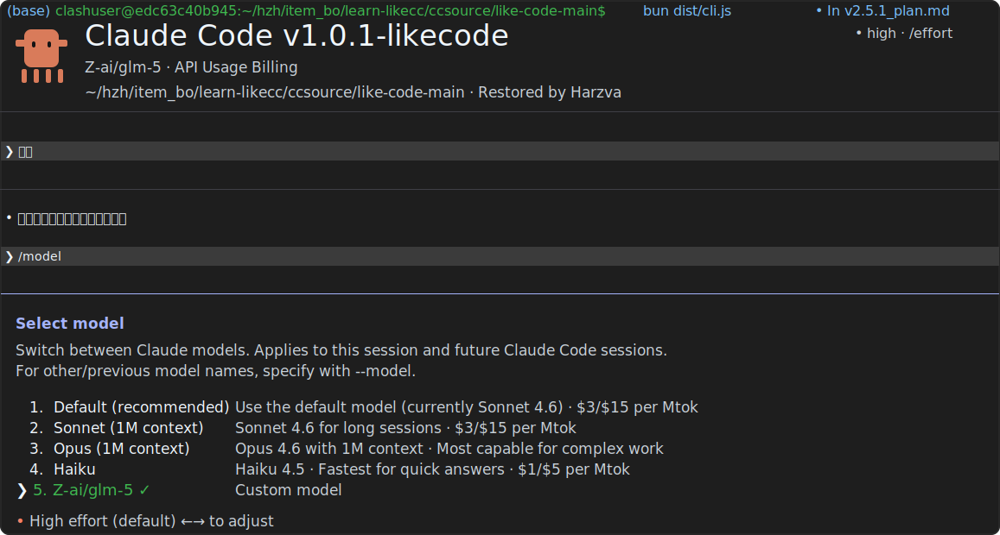

# likecode

An opinionated Claude Code fork focused on routed models, multi-model coordination, and a denser terminal dashboard.

<p align="center">
  
</p>

<p align="center">
  <strong>Current state:</strong> custom route models, alias switching, <code>/mmodel</code> orchestration, HUD/rewind overlay, and improved background task visibility are all working in this fork.
</p>

---

## What likecode adds

- `modelRoutes` with short aliases such as `mm27`, `mm25`, `g5`, `g51`
- `/model` can switch by alias and shows route source + host
- `/mmodel` turns natural-language requests into lightweight multi-model orchestration prompts
- route models can carry optional `pricing` metadata
- startup dashboard shows:
  - built-in models
  - route model alias mapping
  - route source file and host
- double-`Esc` opens a `Rewind | HUD` overlay
- footer and background task UI are tuned for multi-agent work
- `alt+b` opens the tasks panel quickly

---

## Quick Start

```bash
bun install
bun run build
bun run dev
```

For a permissive local dev session:

```bash
bun run dev:danger
```

To build a local standalone binary:

```bash
bun run package:local
```

---

## Route Model Config

Put your route models in `.claude/settings.likecode.local.json`:

```json
{
  "modelRoutes": {
    "MiniMax-M2.7": {
      "alias": "mm27",
      "baseURL": "https://api.minimaxi.com/anthropic",
      "authToken": "YOUR_TOKEN",
      "pricing": {}
    },
    "MiniMax-M2.5": {
      "alias": "mm25",
      "baseURL": "https://api.minimaxi.com/anthropic",
      "authToken": "YOUR_TOKEN",
      "pricing": {}
    },
    "glm-5": {
      "alias": "g5",
      "baseURL": "https://mydamoxing.cn/anthropic",
      "authToken": "YOUR_TOKEN",
      "pricing": {}
    }
  }
}
```

Then you can use:

```text
/model mm27
/model g5
```

---

## `/mmodel`

`/mmodel` is a prompt-level orchestration helper for multi-model work. It does not hardcode a scheduler; it generates a structured instruction that tells Claude to delegate with explicit model aliases.

Example:

```text
/mmodel 用mm25，以及mm21共同写作完成一个贪吃蛇游戏（源码放在这里templete/v4），mm27监视其完成情况。
```

Typical behavior:

- `mm25` handles implementation
- `mm21` handles UI, README, or a second bounded task
- `mm27` monitors progress and reports completion

The monitor flow in this fork is tuned to avoid endless waiting by using bounded checks and a report-oriented finish.

---

## Interface Highlights

### Welcome screen

- current model + host
- built-in model list
- route model alias mapping
- route source file display
- quick hint for `alt+b`

### Rewind / HUD

Double-press `Esc` on an empty input to open:

- `Rewind`: restore or summarize from an earlier point
- `HUD`: inspect session/project token usage and switch HUD mode

### Background tasks

- compact multi-agent footer summaries
- progress bar previews for local agents
- task panel optimized for selecting and drilling into running agents

---

## Scripts

```bash
bun run dev
bun run dev:danger
bun run build
bun run package:local
bun run typecheck
```

---

## Project Notes

This repository started from a Claude Code source study base and is being reshaped into a more experimental operator-focused fork.

Some notable areas in this fork:

- `src/utils/model/modelRoutes.ts`
- `src/utils/model/modelOptions.ts`
- `src/components/LogoV2/CondensedLogo.tsx`
- `src/components/MessageSelector.tsx`
- `src/components/HudPanel.tsx`
- `src/components/tasks/BackgroundTaskStatus.tsx`

---

## Image Assets

README images live in:

```text
docs/images/
```

Right now the repo contains:

- `docs/images/build-success.svg`
- `docs/images/welcome-dashboard.png`
- `docs/images/multi-agent-spec-setup.png`
- `docs/images/monitor-file-checks.png`
- `docs/images/game-entry-build.png`
- `docs/images/monitor-report.png`
- `docs/images/live-monitor-progress.png`
- `docs/images/background-agents-launch.png`
- `docs/images/background-tasks-overview.png`
- `docs/images/monitor-agent-detail.png`

More TUI screenshots can be added there later and referenced directly from the README.

---

## Disclaimer

This repository includes source material originally studied from a public leak event discussed on 2026-03-31. Original Claude Code source remains the property of Anthropic. This fork is a learning and modification project and is not affiliated with Anthropic.
